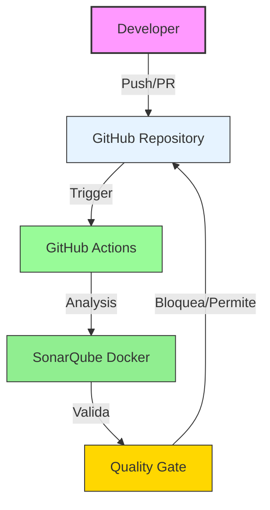

# QAG2 - Quality Assurance & Governance

[](https://github.com/DavCoder22/QAG2/actions/workflows/build.yml)

> Pipeline de QA automatizado con GitHub Actions y SonarQube (self-hosted) para análisis de código y validación de Pull Requests.

## Arquitectura



## Tech Stack

| Componente | Tecnología |
|------------|------------|
| CI/CD | GitHub Actions |
| Análisis de Código | SonarQube (Docker self-hosted) |
| Lenguaje | Node.js/JavaScript |
| Testing | Jest |

## Primeros Pasos

### Levantar SonarQube con Docker

```bash
# Iniciar SonarQube
docker-compose up -d

# Acceder: http://localhost:9000
# Login: admin / admin
```

### Configurar Proyecto

```bash
# Clonar repositorio
git clone https://github.com/DavCoder22/QAG2.git
cd QAG2

# Instalar dependencias
npm install

# Generar token en SonarQube: Administration → Security → Users → Tokens
```

### Secrets de GitHub Actions

| Secret | Value |
|--------|-------|
| `SONAR_TOKEN` | Token de SonarQube |
| `SONAR_HOST_URL` | URL de SonarQube (ej: http://localhost:9000) |
| `SONAR_PROJECT_KEY` | QAG2 |

## Pipeline de CI/CD

- **build.yml**: Compilación y tests
- **sonarqube-selfhosted.yml**: Análisis con SonarQube self-hosted
- **quality-gate.yml**: Validación de Quality Gate

## Documentación

- [Setup Docker SonarQube](docs/SETUP_DOCKER.md)
- [Quality Gates](docs/QUALITY_GATES.md)

## Licencia

MIT