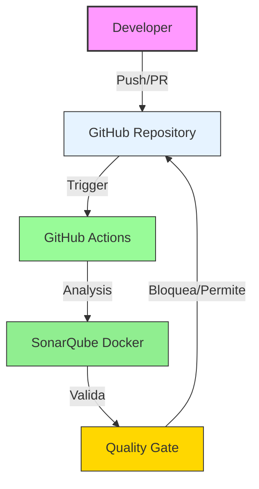

# QAG2 - Quality Assurance & Governance

[](https://github.com/DavCoder22/QAG2/actions/workflows/build.yml)

> Pipeline de QA automatizado con GitHub Actions y SonarQube (self-hosted) para análisis de código y validación de Pull Requests.

## Arquitectura



## Tech Stack

| Componente | Tecnología |
|------------|------------|
| CI/CD | GitHub Actions |
| Análisis de Código | SonarQube (Docker self-hosted) |
| Quality Gates | Sonar Way (default) |

## Primeros Pasos

### Levantar SonarQube con Docker

```bash
# Iniciar SonarQube
docker-compose up -d

# Acceder: http://localhost:9000
# Login: admin / admin
```

### Secrets de GitHub Actions

| Secret | Value |
|--------|-------|
| `SONAR_TOKEN` | Token de SonarQube |
| `SONAR_HOST_URL` | URL de SonarQube |
| `SONAR_PROJECT_KEY` | QAG2 |

## Quality Gates

El pipeline incluye validación automática de Quality Gates:

- **Bugs**: 0 permitidos en código nuevo
- **Vulnerabilidades**: 0 permitidas
- **Coverage**: >= 80%
- **Duplicación**: < 3%

Ver [Quality Gates](docs/QUALITY_GATES.md) para más detalles.

## Pipeline de CI/CD

- **build.yml**: Compilación y tests
- **sonarqube-selfhosted.yml**: Análisis con SonarQube + Quality Gate

## Licencia

MIT