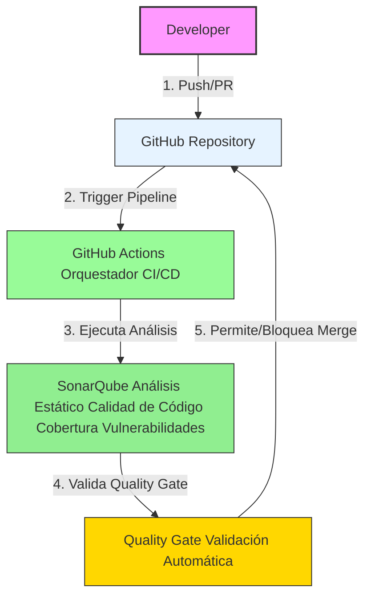

# QAG2 - Quality Assurance & Governance

[](https://github.com/DavCoder22/QAG2/actions/workflows/build.yml)
[](https://sonarcloud.io/dashboard?id=QAG2)

> Pipeline de QA automatizado con GitHub Actions y SonarQube/SonarCloud para análisis de código y validación de Pull Requests.

## Arquitectura del Pipeline



## Descripción

Pipeline de CI/CD robusto para garantizar la calidad del código a través de:

- **Orquestación**: GitHub Actions como motor de CI/CD
- **Análisis Estático**: SonarQube/SonarCloud para calidad de código, cobertura y vulnerabilidades
- **Quality Gates**: Validación automática de PRs antes del merge

## Tech Stack

| Categoria | Tecnología |
|-----------|------------|
| Orquestador | GitHub Actions |
| Análisis de Código | SonarCloud (SonarQube) |
| Lenguaje | Node.js/JavaScript |
| Testing | Jest |

## Primeros Pasos

### Requisitos Previos
- Node.js >= 18.x
- npm >= 9.x

### Instalación

```bash
git clone https://github.com/DavCoder22/QAG2.git
cd QAG2
npm install
npm test
```

## Pipeline de CI/CD

El pipeline se ejecuta automáticamente en:
- Push a `main` o `develop`
- Pull Requests hacia `main`

### Jobs del Pipeline

1. **Build** - Compilación del proyecto
2. **Test** - Ejecución de pruebas unitarias
3. **SonarCloud Analysis** - Análisis estático de código
4. **Quality Gate** - Validación de estándares de calidad

## Configuración

### Secrets de GitHub Actions

| Secret | Descripción |
|--------|-------------|
| `SONAR_TOKEN` | Token de autenticación de SonarCloud |
| `SONAR_ORGANIZATION` | Organización en SonarCloud |
| `SONAR_PROJECT_KEY` | Clave del proyecto en SonarCloud |

### Calidad de Código

- **Coverage mínimo**: 80%
- **Duplicación máxima**: 3%
- **Bugs/Vulnerabilidades**: 0 permitidas en código nuevo

## Branch Protection Rules

1. **Settings → Branches → Branch protection rules**
2. Crear regla para `main`:
   - ✅ Require pull request reviews before merging
   - ✅ Require status checks to pass (incluir "SonarCloud Analysis")
   - ✅ Require branches to be up to date
   - ✅ Include administrators

## Documentación Adicional

- [Setup SonarCloud](docs/SETUP_SONARCLOUD.md) - Configuración paso a paso
- [Quality Gates](docs/QUALITY_GATES.md) - Definición de métricas
- [Arquitectura del Pipeline](docs/PIPELINE.md) - Diagramas y detalles

## Licencia

MIT License